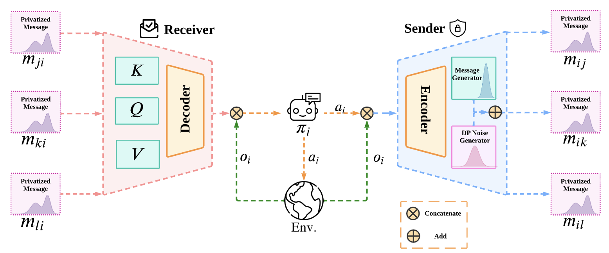

# DPMAC: Differentially Private Communication for Cooperative Multi-Agent Reinforcement Learning (IJCAI 2023)
Original PyTorch implementation of **DPMAC** from

*DPMAC: Differentially Private Communication for Cooperative Multi-Agent Reinforcement Learning* by

[Canzhe Zhao](https://canvolcano.github.io/)\*, [Yanjie Ze](https://yanjieze.com/)\*, [Jing Dong](https://scholar.google.com/citations?user=g5pYW10AAAAJ&hl=en), [Baoxiang Wang](https://bxiangwang.github.io/), [Shuai Li](https://shuaili8.github.io/)

    

## Instructions
1. Run each .sh file to get the results (remember to substitute the GPU indexes, plz see scripts/train_mpe_nohup.sh and scripts/train_pp_nohup.sh for detailed meanings of each parameter).
2. Environment name mapping:
    1. PP (in codes) -> Predator Prey (in paper).
    2. Poreference (in codes) -> Cooperative Communication & Navigation (in paper).
    3. SimSpread (in codes) -> Cooperative Navigation (in paper).
3. Dependences: forMARL.yaml.
4. Some modules are useless and will be deleted in the future. Please ignore such modules.
